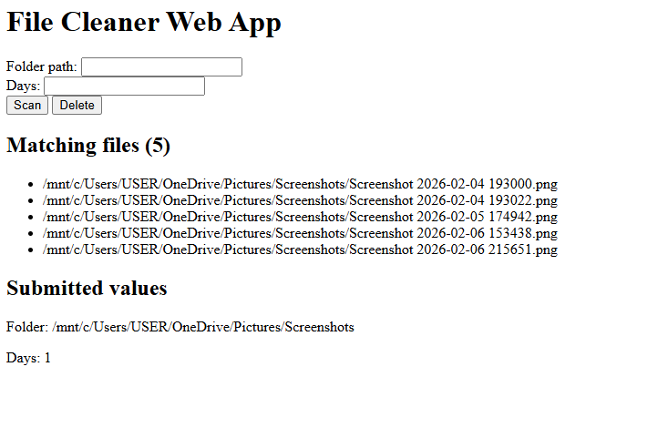
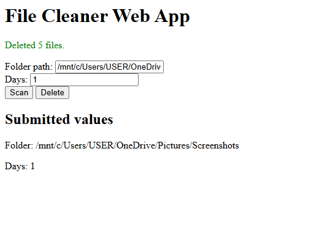

# File Cleaner Web App

This app is used to find files older than your input number of days and optionally delete them. 

## Usage - CLI
```bash
python3 cleaner.py /path/to/folder DAYS [--dry-run]
```
Examples:

```bash
# Preview files older than 7 days (no deletion)
python3 cleaner.py /path/to/folder 7 --dry-run

# Delete files older than 30 days (with confirmation)
python3 cleaner.py /path/to/folder 30
```

## Usage - Web API
```bash
python3 app.py
```
Then open http://localhost:5000 in your browser

## Notes (WSL)

If you run this in WSL, Windows paths like `C:\Users\...` are available under `/mnt/c/Users...`.

## Requirements

- Python 3
- Flask (for the web UI)

You can install Flask (in a virtual environment or user-wide) with:

```bash
pip install flask
```

## Screenshots

### Scan



### Deletion

